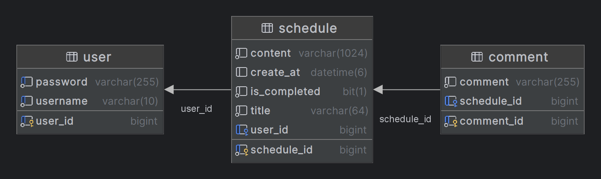

# 📅 개인 일정 관리 프로그램

개인 일정을 관리하는 캘린더 API

---
### 레거시 코드 주차

### 1일차
1. Controller Advice 로 예외 공통화 처리하기
- [x] @RestControllerAdvice 를 사용해서 모든 RestController 의 예외를 공통화해서 처리해주세요!
2. Service 인터페이스와 구현체 분리하여 추상화 하기
   - [x]ervice 클래스를 인터페스와 구현체로 분리하고 인터페이스 메서드에 주석을 친절하게 달아주세요!

### 2일차
1. CustomException 정의
- [x] 애플리케이션에서 발생하는 예외상황은 정말 다양한데 기존에 존재하는 Exception 만 가지고 구현하려니 힘드셨죠?
- [x] 이제는 `RuntimeException`을 상속 받아서 CustomException 을 상황에 맞게 만들어보세요.
### 2. Spring AOP 적용
- [x] Spring AOP 를 사용하여 부가기능을 추가해보세요.(Controller 적용)
### 3 일차
- [x] QueryDSL 의 jpaQueryFactory 를 사용해서 검색기능을 만들어주세요! (ScheduleServiceImpl에 적용)
### 4 일차 - Pageable 을 사용하여 페이징 및 정렬 기능 만들기
- [x] Pageable 을 사용해서 원하는 페이지 사이즈만큼만 조회 해주세요! (QueryDSL에 적용)
### 5 일차 - Controller 테스트 코드 작성하기
- △ MockMvc 를 사용해서 Controller 테스트 코드를 작성해주세요!
    - @RestControllerAdvice파트 테스트가 좀 모자람
### 6 일차 - Service 테스트 코드 작성하기
- △ Mockito 을 사용하여 Service 테스트 코드를 작성해주세요!
    - 일부 Service를 테스트하지 못함
### 7 일차 -Repository 테스트 코드 작성하기
- △ @DataJpaTest 를 사용해서 Repository 테스트 코드를 작성해주세요!
    - 일부 Repository를 테스트하지 못함
### 8일차 AWS EC2 를 이용해 애플리케이션 .jar 파일 배포하기
- 과제 내용 : 깃허브에서 clone or pull을 통해 코드를 가져오고 빌드하여 jar 파일 실행하기
- 실제 내용 : EC2에서 도커를 이용해서 실행
### 과제 미포함 구현사항
- jacoco 적용 (테스트 커버리지 46%)
- swagger 적용 (http://bit.ly/4afup4O) - 도메인을 구입하지 않아 http 상태입니다
- redis를 이용한 refreshToken 적용
- 도커를 이용한 호스팅
- jwt토큰 DB를 방문하지 않도록 기능 개선
### 과제 진행 후 질문사항
- 모든 기본 JPA를 QueryDSL로 변경해야 하는지 아니면 join이 많이 필요하거나 N+1문제가 발생하는 부분에 대해서만 사용하는건지 궁금합니다.
- QueryDSL을 사용하는것으로 jacoco에 테스트커버리지를 확인할 때 QEntity가 지분을 차지하는데 이런것도 테스트를 해야하는것인지 궁금합니다.
- 강의에서 보면 Nginx를 이용해서 간단한 html파일을 나타내는 부분이 있는데 스프링부트도 Nginx를 이용해서 호스팅해야하는지 그리고 그렇게 했을 때 어떤점이 더 좋은지 궁금합니다.
ㄱ

---

## 🎛️ API 명세서
https://teamsparta.notion.site/1ffcb79d0cfc41c6a86a2b2bd8c68aa2?v=763dbd31df384d2baec10c70b9ad7c31

## 🔐 ERD
### **Table**

### **관계 설정**

1. 유저 한명은 여러개의 스케줄을 작성할 수 있다.
   User : Schedule = 1 : N
2. 하나의 스케줄은 여러개의 댓글을 작성할 수 있다.
   Schedule : Comment = 1 : N
3. 유저 한명은 여러개의 댓글을 작성할 수 있다.
   User : Comment = 1 : N

## 📚 기능 정의

- [x] **회원 가입 API**
  - username, password를 Client에서 전달받기
  - username은  `최소 4자 이상, 10자 이하이며 알파벳 소문자(a~z), 숫자(0~9)`로 구성되어야 한다.
  - password는  `최소 8자 이상, 15자 이하이며 알파벳 대소문자(a~z, A~Z), 숫자(0~9)`로 구성되어야 한다.
  - DB에 중복된 username이 없다면 회원을 저장하고 Client 로 성공했다는 메시지, 상태코드 반환하기

- [x] **로그인 API**
  - username, password를 Client에서 전달받기
  - DB에서 username을 사용하여 저장된 회원의 유무를 확인하고 있다면 password 비교하기
  - 로그인 성공 시, 로그인에 성공한 유저의 정보와 JWT를 활용하여 토큰을 발급하고,
    발급한 토큰을 Header에 추가하고 성공했다는 메시지, 상태코드 와 함께 Client에 반환하기

- [x] **할일카드 작성 기능 API**
  - 토큰을 검사하여, 유효한 토큰일 경우에만 할일 작성 가능
  - `할일 제목`,`할일 내용`, `작성일`을 저장할 수 있습니다.
  - 할일 제목, 할일 내용을 저장하고 저장된 할일을 Client 로 반환하기(username은 로그인 된 사용자)

- [x] **선택한 할일카드 조회 기능 API**
  - 선택한 할일 의 정보를 조회할 수 있습니다.
    - 반환 받은 할일 정보에는 `할일 제목`,`할일 내용`, `작성자` , `작성일`정보가 들어있습니다.

- [x] **할일카드 목록 조회 기능 API**
  - 등록된 할일 전체를 조회할 수 있습니다.
      - 회원별로 각각 나누어서 할일 목록이 조회됩니다.
      - 반환 받은 할일 정보에는 `할일 제목`, `작성자` , `작성일`, `완료 여부`정보가 들어있습니다.
  - 조회된 할일 목록은 `작성일` 기준 내림차순으로 정렬 되어있습니다.

- [x] **선택한 할일카드 수정 기능 API**
  - 선택한 할일카드의 `제목`, `작성 내용`을 수정할 수 있습니다.
      - 토큰을 검사한 후, 유효한 토큰이면서 해당 사용자가 작성한 게시글만 수정 가능
      - 할일 제목, 할일 내용을 수정하고 수정된 할일 정보는 Client 로 반환됩니다.
  - 수정된 할일의 정보를 반환 받아 확인할 수 있습니다.
    - 반환 받은 할일 정보에는 `할일 제목`,`할일 내용`, `작성자` , `작성일`정보가 들어있습니다.

- [x] **할일카드 완료 기능 API**
  - 토큰을 검사한 후, 유효한 토큰이면서 해당 사용자가 작성한 할일카드 만 완료 가능
  - 완료처리 한 할일카드는 목록조회시 `완료 여부`필드가 TRUE 로 내려갑니다.
  - `완료 여부` 기본값은 FALSE

- [x]  **댓글 작성 API**
    - 토큰을 검사하여, 유효한 토큰일 경우에만 댓글 작성 가능
    - 선택한 할일의 DB 저장 유무를 확인하기
    - 선택한 할일이 있다면 댓글을 등록하고 등록된 댓글 반환하기

- [x]  **댓글 수정 API**
    - 토큰을 검사한 후, 유효한 토큰이면서 해당 사용자가 작성한 댓글만 수정 가능
    - 선택한 댓글의 DB 저장 유무를 확인하기
    - 선택한 댓글이 있다면 댓글 수정하고 수정된 댓글 반환하기

- [x]  **댓글 삭제 API**
    - 토큰을 검사한 후, 유효한 토큰이면서 해당 사용자가 작성한 댓글만 삭제 가능
    - 선택한 댓글의 DB 저장 유무를 확인하기
    - 선택한 댓글이 있다면 댓글 삭제하고 Client 로 성공했다는 메시지, 상태코드 반환하기

- [x]  **예외 처리 (ResponseEntity 사용)**
    - 토큰이 필요한 API 요청에서 토큰을 전달하지 않았거나 정상 토큰이 아닐 때는 "토큰이 유효하지 않습니다." 라는 에러메시지와 statusCode: 400을 Client에 반환하기
    - 토큰이 있고, 유효한 토큰이지만 해당 사용자가 작성한 게시글/댓글이 아닌 경우에는 “작성자만 삭제/수정할 수 있습니다.”라는 에러메시지와 statusCode: 400을 Client에 반환하기
    - DB에 이미 존재하는 username으로 회원가입을 요청한 경우 "중복된 username 입니다." 라는 에러메시지와 statusCode: 400을 Client에 반환하기
    - 로그인 시, 전달된 username과 password 중 맞지 않는 정보가 있다면 "회원을 찾을 수 없습니다."라는 에러메시지와 statusCode: 400을 Client에 반환하기

- [x] **더 나아가기**
  - [x] 전체 할일카드 목록에서 완료된 카드들은 숨김처리 하는 기능을 추가해주세요!
  - [x] 할일카드를 작성자만 볼 수 있도록 비공개 하는 기능을 추가해주세요!
  - [x] 할일카드 제목으로 검색하여 목록을 출력하는 기능을 추가해주세요!
  - [x] AccessToken, RefreshToken에 대해 구글링해 보고 RefreshToken을 적용해 보세요!
  - [x] 프로젝트에 swagger 를 구글링해 보고 적용해 보세요!
    - swagger란? Open Api Specification(OAS)를 위한 프레임워크 입니다. API들이 가지고 있는 스펙(spec)을 명세, 관리할 수 있으며, 백엔드와 프론트엔드가 협업할 때 사용할 수 있습니다!

---

- [x]  **🆕 DTO, Entity Test 추가하기**
    - [x] `@Test` 를 사용해서 DTO 와 Entity Test 를 추가합니다.
    - [x] User, Todo, Comment, DTO 에 존재하는 메서드들에 대해서 테스트를 추가합니다.
- △  **🆕 Controller Test 추가하기**
    - [x] `@WebMvcTest` 를 사용하여 Controller Test 를 추가합니다.
    -  △ Todo, Comment Controller 에 대해서 테스트를 추가합니다.(성능에 문제)
- [x]  **🆕 Service Test 추가하기**
    - [x] `@ExtendWith` 를 사용하여 Service Test 를 추가합니다.
    - [x] User, UserDetails, Todo, Comment Service 에 대해서 테스트를 추가합니다.
- △  **🆕 Repository Test 추가하기**
    - [x] `@DataJpaTest` 를 사용하여 Repository Test 를 추가합니다.
    -  △ User, Schedule, Comment Repository 에 대해서 테스트를 추가합니다.(Schedule만 구현)
- △  **🆕 통합 Test 추가하기**
    - [x] `@SpringBootTest` 를 사용하여 통합 Test 를 추가합니다.
    -  △ User, Schedule, Comment 에 대해서 테스트를 추가합니다.(Schedule, Comment 구현)

---

### ✅체크리스트

- [ ]  JDBC 와 Persistence Framework 의 차이점에 대해 설명할 수 있다.
    - 공통점 : 둘 다 자바 어플리케이션과 데이터베이스 간의 상호작용을 위한 기술
    - 차이점 : JDBC는 저수준의 데이터베이스 액세스를 위한 API이며, 
              Persistence Framework는 더 높은 추상화를 제공하여 객체지향 프로그래밍과 데이터베이스간의 상호작용을 단순화하고 생산성을 향상시킨다.
    - 수준의 추상화:
       - JDBC는 데이터베이스에 대한 접근을 위한 자바 API를 제공합니다. 개발자는 JDBC를 사용하여 SQL 쿼리를 직접 작성하고 실행해야 합니다. 이는 데이터베이스와의 상호작용을 매우 저수준으로 만듭니다.
       - Persistence Framework는 객체 관계 매핑(Object-Relational Mapping, ORM) 기술을 기반으로 합니다. 이는 데이터베이스의 테이블과 자바 객체 간의 매핑을 자동으로 처리하고, SQL 쿼리를 생성하고 실행하는 작업을 추상화합니다. 개발자는 객체를 사용하여 데이터베이스와 상호작용할 수 있으며, ORM 프레임워크가 이를 데이터베이스 쿼리로 변환하여 처리합니다.
    - 개발 생산성
      - JDBC를 사용하면 개발자가 직접 SQL 쿼리를 작성하고 실행해야 하므로 개발 생산성이 낮을 수 있습니다. 또한 데이터베이스와의 상호작용에 대한 상세한 지식이 필요합니다.
      - Persistence Framework는 개발자가 직접 SQL을 작성하는 대신 객체를 사용하여 데이터를 처리하므로, 개발 생산성이 향상됩니다. 또한 객체 지향 프로그래밍에 더 가깝기 때문에 코드의 유지보수성도 높아집니다.
    - 성능
      - JDBC는 직접 SQL을 작성하고 실행하기 때문에 성능이 좋을 수 있습니다. 그러나 개발자가 최적화된 SQL을 작성할 수 있는 능력에 따라 달라집니다.
      - Persistence Framework는 ORM 기술을 사용하여 객체와 데이터베이스 간의 매핑을 처리하므로 성능이 저하될 수 있습니다. 그러나 대부분의 ORM 프레임워크는 캐시, 지연로딩 등의 기능을 제공하여 성능을 최적화할 수 있습니다.
    - 유지보수성
      - JDBC 코드는 SQL 쿼리와 관련된 모든 로직이 자바 코드에 포함되어 있기 때문에 유지보수가 어려울 수 있습니다. SQL 쿼리의 변경이 필요한 경우 모든 관련 코드를 업데이트해야 합니다.
      - Persistence Framework는 객체와 데이터베이스 간의 매핑을 자동으로 처리하므로 유지보수가 쉬울 수 있습니다. 객체 모델이 변경되더라도 ORM 프레임워크가 자동으로 데이터베이스 스키마를 업데이트할 수 있습니다.
- [ ]  JDBC Template 과 MyBatis 의 차이점에 대해 설명할 수 있다.
    - 차이점
      - JDBC Template은 간단하고 직접적인 데이터베이스 액세스를 위한 용도로 사용되며, MyBatis는 복잡한 SQL 쿼리와 객체 매핑이 필요한 경우에 사용됩니다. MyBatis를 사용하면 SQL 쿼리와 자바 객체 간의 매핑을 더 쉽게 처리할 수 있으며, 유지보수성을 향상시킬 수 있습니다.
      - 추상화 수준
        - JDBC Template은 JDBC API를 감싼 간단한 추상화 계층입니다. JDBC Template을 사용하면 일반적인 JDBC 코드보다 훨씬 더 간결하고 쉽게 데이터베이스 액세스를 수행할 수 있습니다. 그러나 SQL 쿼리를 여전히 직접 작성하고 매핑해야 합니다.
        - MyBatis는 SQL Mapper 프레임워크로서 SQL 쿼리와 자바 객체 간의 매핑을 처리하는데 중점을 둡니다. MyBatis를 사용하면 SQL을 XML 또는 어노테이션을 통해 작성하고, 결과를 자바 객체에 매핑할 수 있습니다. 따라서 더 높은 수준의 추상화를 제공합니다.
      - SQL 쿼리 관리
        - JDBC Template을 사용하는 경우 SQL 쿼리를 직접 작성하고 관리해야 합니다. 이는 SQL 쿼리의 변경 및 유지보수가 번거로울 수 있습니다. 
        - MyBatis는 SQL을 외부 파일(XML) 또는 어노테이션을 통해 분리하여 관리합니다. 이렇게 하면 SQL 쿼리를 중앙 집중식으로 관리할 수 있고, 유지보수가 쉬워집니다.
      - 객체 매핑 
        - JDBC Template은 간단한 RowMapper 인터페이스를 사용하여 결과 세트의 각 행을 자바 객체로 매핑합니다. 하지만 이 매핑은 직접 구현해야 합니다.
        - MyBatis는 SQL 쿼리와 자바 객체 간의 매핑을 자동으로 처리합니다. 개발자는 매핑 규칙을 정의하기 위해 XML 파일이나 어노테이션을 사용할 수 있습니다.
      - 유연성
        - JDBC Template은 간단하고 직접적이며, 프로젝트에 대한 특정 요구 사항을 충족시킬 수 있습니다.
        - MyBatis는 복잡한 SQL 쿼리와 객체 매핑이 필요한 경우에 유용합니다. 또한 MyBatis를 사용하면 동적 쿼리 작성 및 다양한 매핑 기술을 쉽게 활용할 수 있습니다.
- [ ]  SQL Mapper 와 ORM 의 차이점에 대해 설명할 수 있다.
- [ ]  MyBatis 가 쿼리를 생성하는 2가지 방법에 대해 설명할 수 있다.
- [ ]  영속성 컨텍스트와 쓰기지연의 연관성에 대해서 설명할 수 있다.
- [ ]  다대다 관계를 현업에서 주로 어떻게 구현하여 사용하는지 설명할 수 있다.
- [ ]  부모가 자식의 영속성을 완전히 관리하기 위해서 사용하는 cascade 옵션을 설명할 수 있다.
- [ ]  현업에서 주로 사용하는 Fetch 전략에 대해서 설명할 수 있다.
- [ ]  QueryDSL 의 버전별 연동방법을 설명할 수 있다.
- [ ]  QueryDSL 로 페이징 및 정렬 쿼리를 작성할 수 있다.
- [ ]  JPA 쿼리가 응답해주는 Page<T>, Slice<T>, Iterable<T> 의 차이점을 설명할 수 있다.
- [ ]  Entity 의 일부필드만으로 생성 또는 업데이트 하는 방법을 설명할 수 있다.
- [ ]  Transcation 의 Isolation 과 propagation 종류 및 차이점에 대해 설명할 수 있다.
- [ ]  현업에서 사용하는 Transaction 전파전략을 설명할 수 있다.
- [ ]  SpringDataJpa 에서 제공하는 여러 고급 기능들의 사용방법을 설명할 수 있다.