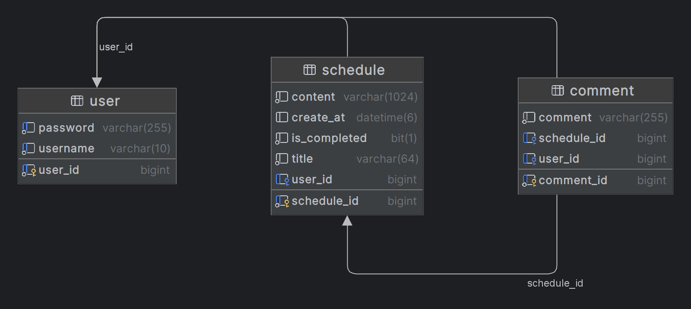

# 📅 개인 일정 관리 프로그램

개인 일정을 관리하는 캘린더 API

## 🎛️ API 명세서
https://teamsparta.notion.site/1ffcb79d0cfc41c6a86a2b2bd8c68aa2?v=763dbd31df384d2baec10c70b9ad7c31

## 🔐 ERD
### **Table**

### **관계 설정**

1. 유저 한명은 여러개의 스케줄을 작성할 수 있다.
   User : Schedule = 1 : N
2. 하나의 스케줄은 여러개의 댓글을 작성할 수 있다.
   Schedule : Comment = 1 : N
3. 유저 한명은 여러개의 댓글을 작성할 수 있다.
   User : Comment = 1 : N

## 📚 기능 정의

- [x] **회원 가입 API**
  - username, password를 Client에서 전달받기
  - username은  `최소 4자 이상, 10자 이하이며 알파벳 소문자(a~z), 숫자(0~9)`로 구성되어야 한다.
  - password는  `최소 8자 이상, 15자 이하이며 알파벳 대소문자(a~z, A~Z), 숫자(0~9)`로 구성되어야 한다.
  - DB에 중복된 username이 없다면 회원을 저장하고 Client 로 성공했다는 메시지, 상태코드 반환하기

- [x] **로그인 API**
  - username, password를 Client에서 전달받기
  - DB에서 username을 사용하여 저장된 회원의 유무를 확인하고 있다면 password 비교하기
  - 로그인 성공 시, 로그인에 성공한 유저의 정보와 JWT를 활용하여 토큰을 발급하고,
    발급한 토큰을 Header에 추가하고 성공했다는 메시지, 상태코드 와 함께 Client에 반환하기

- [x] **할일카드 작성 기능 API**
  - 토큰을 검사하여, 유효한 토큰일 경우에만 할일 작성 가능
  - `할일 제목`,`할일 내용`, `작성일`을 저장할 수 있습니다.
  - 할일 제목, 할일 내용을 저장하고 저장된 할일을 Client 로 반환하기(username은 로그인 된 사용자)

- [x] **선택한 할일카드 조회 기능 API**
  - 선택한 할일 의 정보를 조회할 수 있습니다.
    - 반환 받은 할일 정보에는 `할일 제목`,`할일 내용`, `작성자` , `작성일`정보가 들어있습니다.

- [x] **할일카드 목록 조회 기능 API**
  - 등록된 할일 전체를 조회할 수 있습니다.
      - 회원별로 각각 나누어서 할일 목록이 조회됩니다.
      - 반환 받은 할일 정보에는 `할일 제목`, `작성자` , `작성일`, `완료 여부`정보가 들어있습니다.
  - 조회된 할일 목록은 `작성일` 기준 내림차순으로 정렬 되어있습니다.

- [x] **선택한 할일카드 수정 기능 API**
  - 선택한 할일카드의 `제목`, `작성 내용`을 수정할 수 있습니다.
      - 토큰을 검사한 후, 유효한 토큰이면서 해당 사용자가 작성한 게시글만 수정 가능
      - 할일 제목, 할일 내용을 수정하고 수정된 할일 정보는 Client 로 반환됩니다.
  - 수정된 할일의 정보를 반환 받아 확인할 수 있습니다.
    - 반환 받은 할일 정보에는 `할일 제목`,`할일 내용`, `작성자` , `작성일`정보가 들어있습니다.

- [x] **할일카드 완료 기능 API**
  - 토큰을 검사한 후, 유효한 토큰이면서 해당 사용자가 작성한 할일카드 만 완료 가능
  - 완료처리 한 할일카드는 목록조회시 `완료 여부`필드가 TRUE 로 내려갑니다.
  - `완료 여부` 기본값은 FALSE

- [x]  **댓글 작성 API**
    - 토큰을 검사하여, 유효한 토큰일 경우에만 댓글 작성 가능
    - 선택한 할일의 DB 저장 유무를 확인하기
    - 선택한 할일이 있다면 댓글을 등록하고 등록된 댓글 반환하기

- [x]  **댓글 수정 API**
    - 토큰을 검사한 후, 유효한 토큰이면서 해당 사용자가 작성한 댓글만 수정 가능
    - 선택한 댓글의 DB 저장 유무를 확인하기
    - 선택한 댓글이 있다면 댓글 수정하고 수정된 댓글 반환하기

- [x]  **댓글 삭제 API**
    - 토큰을 검사한 후, 유효한 토큰이면서 해당 사용자가 작성한 댓글만 삭제 가능
    - 선택한 댓글의 DB 저장 유무를 확인하기
    - 선택한 댓글이 있다면 댓글 삭제하고 Client 로 성공했다는 메시지, 상태코드 반환하기

- [x]  **예외 처리 (ResponseEntity 사용)**
    - 토큰이 필요한 API 요청에서 토큰을 전달하지 않았거나 정상 토큰이 아닐 때는 "토큰이 유효하지 않습니다." 라는 에러메시지와 statusCode: 400을 Client에 반환하기
    - 토큰이 있고, 유효한 토큰이지만 해당 사용자가 작성한 게시글/댓글이 아닌 경우에는 “작성자만 삭제/수정할 수 있습니다.”라는 에러메시지와 statusCode: 400을 Client에 반환하기
    - DB에 이미 존재하는 username으로 회원가입을 요청한 경우 "중복된 username 입니다." 라는 에러메시지와 statusCode: 400을 Client에 반환하기
    - 로그인 시, 전달된 username과 password 중 맞지 않는 정보가 있다면 "회원을 찾을 수 없습니다."라는 에러메시지와 statusCode: 400을 Client에 반환하기

- [ ] **더 나아가기**
  - [x] 전체 할일카드 목록에서 완료된 카드들은 숨김처리 하는 기능을 추가해주세요!
  - [x] 할일카드를 작성자만 볼 수 있도록 비공개 하는 기능을 추가해주세요!
  - [x] 할일카드 제목으로 검색하여 목록을 출력하는 기능을 추가해주세요!
  - [x] AccessToken, RefreshToken에 대해 구글링해 보고 RefreshToken을 적용해 보세요!
  - [ ] 프로젝트에 swagger 를 구글링해 보고 적용해 보세요!
    - swagger란? Open Api Specification(OAS)를 위한 프레임워크 입니다. API들이 가지고 있는 스펙(spec)을 명세, 관리할 수 있으며, 백엔드와 프론트엔드가 협업할 때 사용할 수 있습니다!
  

<aside>
❓ **Why: 과제 제출시에는 아래 질문을 고민해보고 답변을 함께 제출해주세요.**

</aside>

1. [x] 처음 설계한 API 명세서에 변경사항이 있었나요? 
   - 변경 되었다면 어떤 점 때문 일까요? 첫 설계의 중요성에 대해 작성해 주세요!
     - 추가사항을 고려하지 않고 설계를 함, 추가로 Entity와의 관계에서 생각과는 다른 부분이 존재했음
2. [x] ERD를 먼저 설계한 후 Entity를 개발했을 때 어떤 점이 도움이 되셨나요?
   - Entity 패키지 내 클래스 생성이 매우 편했음
3. [x] JWT를 사용하여 인증/인가를 구현 했을 때의 장점은 무엇일까요?
    - 로그인 기능을 사용할 수 있으며 검증이 가능하다.
    - 세션 방식과 비교하면 추가 데이터 저장소가 필요없다.
4. [x] 반대로 JWT를 사용한 인증/인가의 한계점은 무엇일까요?
    - 인증 인가에 필요한 jwt 토큰의 길이가 길어지면 세션방식보다 리소스 사용량이 증가할 수 있다.
    - 토큰을 만료시킬 수 있는 방법이 없다.
    - 리프레시 토큰을 데이터 저장소에 저장 할 경우 세션방식과 다를게 없어 장점을 잃는다.
5. [x] 만약 댓글이 여러개 달려있는 할일을 삭제하려고 한다면 무슨 문제가 발생할까요? Database 테이블 관점에서 해결방법이 무엇일까요?
    - 남아있는 댓글이 참조할 할일이 없어 오류가 발생된다. 연결되어있는 내용을 모두 삭제하도록 CASCADE 설정을 해야한다.
6. [x] IoC / DI 에 대해 간략하게 설명해 주세요!
    - IoC : (제어의 역전)  controller - service - repository 순으로 이루어지던 접근 순서를 DI를 통해 repository - service - controller 순으로 변경한다. 
    - DI : (의존성 주입) : 제어의 역전의 주요 핵심이며 여러개의 controller가 생성되면 여러개의 service, repository를 생성해야 한다.
      따라서 미리 repository, service를 하나씩 만들어 필요한 controller에 주입하여 객체를 공유한다.